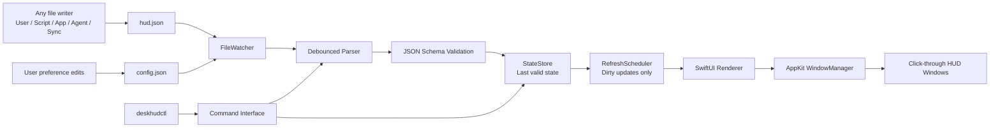

# DeskHUD v1 Design Spec

Date: 2026-06-27

## Summary

DeskHUD v1 is a native macOS HUD runtime for Apple Silicon-first systems. It is a completely read-only, file-driven overlay layer that displays persistent information in the unused areas around the Dock, defaulting to the bottom-left and bottom-right spaces beside the Dock.

DeskHUD does not generate content, run AI, call external models, poll services, or own business logic for calendars, tasks, agents, Git, weather, or productivity systems. It only watches configuration and content files. When those files change, it parses them and updates the HUD. If the files do not change, DeskHUD keeps showing the last successful state and stays as idle as possible.

The writer of the files can be anything: a user, an AI agent, a shell script, another app, a sync process, a CI job, or a local automation. DeskHUD treats all writers the same.

## Product Definition

DeskHUD is not a desktop widget system, not a menu bar customization tool, not a desktop beautification app, and not an AI client. It is a persistent HUD system.

The default product experience is:

- two read-only HUDs, one near the Dock's left side and one near the Dock's right side;
- visible while the user works mostly in full-screen apps;
- no interaction on the HUD itself;
- no focus stealing;
- no mouse blocking;
- no active work while files remain unchanged.

The architecture should remain general enough to support additional slots later, but v1 should optimize the first-class experience around the Dock-side HUDs.

## Scope

### In Scope

- Native macOS App built with SwiftUI plus focused AppKit window management.
- Apple Silicon-first design.
- Minimum macOS version: macOS 14.
- File-driven rendering through `config.json` and `hud.json`.
- JSON Schema for config and HUD payload validation.
- CLI tool, `deskhudctl`, as a first-class companion.
- Fully read-only overlay windows.
- Click-through HUD windows.
- Multi-display support with identical HUD content on every display.
- Default full-screen overlay support with compatibility fallback.
- Low, medium, and high visual effect profiles, provided they remain measurable and optional.
- Examples and built-in sample payloads.

### Out of Scope for v1

- Built-in AI model integration.
- MCP server implementation.
- Network providers.
- Calendar, Git, weather, task, or agent business logic inside the app.
- In-HUD interaction, editing, buttons, scrolling, text input, or hover controls.
- Desktop-wide arbitrary widget placement as the default experience.
- Private SkyLight/SLS/CGS APIs as the main implementation strategy.

MCP and richer provider ecosystems can be designed later as separate companion layers, not as part of the main always-running app process.

## Architecture



### Core Components

- `DeskHUDApp`: app lifecycle, activation policy, menu bar entry, settings window.
- `WindowManager`: owns AppKit overlay windows or panels per display and slot.
- `FileWatcher`: watches `config.json` and `hud.json` using system file events.
- `Parser`: debounced JSON reading, retry, schema validation, previous-good fallback.
- `StateStore`: stores current config, current HUD payload, last valid render state, and recent errors.
- `RefreshScheduler`: coalesces updates and only refreshes affected slots.
- `Renderer`: SwiftUI views that render immutable HUD snapshots.
- `EffectProfile`: low, medium, high rendering rules.
- `CLI`: `deskhudctl` for status, validation, reload, examples, and recovery.

## File Model

v1 uses two files:

- `config.json`: low-frequency user preferences.
- `hud.json`: high-frequency display content.

DeskHUD watches both. `hud.json` is expected to change more often. The app should debounce file events and avoid unnecessary reparsing when possible.

### `config.json`

Config controls stable preferences:

- config directory;
- theme;
- font family and size;
- opacity;
- corner radius;
- margins;
- width and height overrides;
- content density;
- effect profile;
- full-screen mode;
- menu bar visibility;
- Dock icon visibility;
- multi-display behavior;
- debug logging.

### `hud.json`

HUD content uses a generic slot model:

```json
{
  "version": 1,
  "slots": [
    {
      "id": "leftDock",
      "anchor": "dock.left",
      "rotation": { "enabled": false },
      "items": []
    },
    {
      "id": "rightDock",
      "anchor": "dock.right",
      "rotation": { "enabled": false },
      "items": []
    }
  ]
}
```

The default anchors are `dock.left` and `dock.right`. Future versions may support more anchors, custom frames, or per-display slot routing, but v1 should keep the default experience narrow.

## Rendering Model

DeskHUD uses generic primitives with optional semantic `kind`.

Primitive item types:

- `text`: title, subtitle, summary, short message.
- `metric`: number, percentage, count, quota.
- `progress`: linear, segmented, or compact progress.
- `list`: todo, agenda, meeting list, checklist.
- `status`: badge, phase, state, signal.

Semantic `kind` values are allowed, such as:

- `aiProgress`
- `meeting`
- `today`
- `todo`
- `goal`
- `systemStatus`

The `kind` can influence default styling, but it must not introduce business logic. For example, `kind: "aiProgress"` may choose a progress-oriented visual style, but DeskHUD does not know how Claude Code, Codex, or any other external system works.

Example:

```json
{
  "type": "progress",
  "kind": "aiProgress",
  "title": "Build",
  "value": 0.62,
  "label": "Working on parser",
  "state": "running"
}
```

## Rotation

Rotation is mixed-mode:

- default: disabled, no timer;
- optional per slot: enabled, low-frequency timer;
- no global timer unless at least one slot has rotation enabled.

If `rotation.enabled` is false, DeskHUD does not cycle items on its own. External writers can change `hud.json` whenever they want the display to change.

If `rotation.enabled` is true, DeskHUD may rotate between items at a configured interval. This is the only normal case where DeskHUD performs scheduled work without a file change.

## File Reliability

DeskHUD should be friendly to imperfect file writers.

Behavior:

- debounce file events, for example 100-300 ms;
- attempt a short retry if the file is temporarily unreadable or partially written;
- keep the previous valid state if parsing or validation fails;
- log the error without blanking the HUD;
- expose the last error through settings and `deskhudctl status`.

Documentation should recommend atomic writes:

1. write `hud.json.tmp`;
2. flush and close;
3. rename to `hud.json`.

This is recommended but not strictly required.

## Window Behavior

HUD windows are:

- read-only;
- transparent or translucent;
- borderless;
- non-activating;
- click-through;
- positioned by `NSScreen.visibleFrame` and user config;
- stable in size;
- defaulted to Dock-side bottom slots;
- duplicated across displays in v1.

Full-screen behavior:

- default: try to show above full-screen apps;
- use official AppKit behavior such as `canJoinAllSpaces` and `fullScreenAuxiliary`;
- provide compatibility fallback: desktop-only mode;
- do not rely on private SkyLight/SLS/CGS APIs as the primary path.

## Layout

v1 uses default adaptive sizing with configuration overrides.

Default layout should:

- compute per-display frames from `visibleFrame`;
- adapt to Dock location and screen size;
- keep the HUD frame stable;
- avoid resizing the window based on content;
- truncate, compress, or rotate content rather than growing unexpectedly.

Config may override:

- width;
- height;
- margin;
- corner radius;
- max lines;
- content density.

## Multi-Display

v1 displays the same HUD content on every screen.

Each display receives:

- one `dock.left` HUD;
- one `dock.right` HUD;
- independently calculated geometry.

Future versions may support per-display routing, but v1 should treat display-specific content as reserved schema space rather than required behavior.

## Background and Recovery

Default:

- no Dock icon;
- menu bar entry visible.

User may enable an immersive mode:

- hide menu bar entry;
- keep Dock icon hidden;
- leave only the HUD visible.

Because fully hidden UI needs a recovery path, `deskhudctl` must provide commands such as:

- `deskhudctl show-settings`
- `deskhudctl status`
- `deskhudctl reload`

Re-launching the app may also open settings if the app is already running and all visible control surfaces are hidden.

## Settings Window

v1 includes a minimal settings window, not a full visual configuration editor.

It should provide:

- current config directory;
- open `config.json`;
- open `hud.json`;
- reveal config folder;
- reload config;
- launch at login toggle;
- Dock icon visibility toggle;
- menu bar visibility toggle;
- current parser status;
- recent error summary.

Detailed appearance, theme, layout, and content configuration stay in JSON.

## CLI

`deskhudctl` is a first-class v1 companion.

Required commands:

- `deskhudctl status`
- `deskhudctl reload`
- `deskhudctl validate config <path>`
- `deskhudctl validate hud <path>`
- `deskhudctl sample minimal`
- `deskhudctl sample today`
- `deskhudctl sample todo`
- `deskhudctl sample meeting`
- `deskhudctl sample ai-progress`
- `deskhudctl sample goal`
- `deskhudctl show-settings`
- `deskhudctl open-config`
- `deskhudctl open-hud`

The CLI should not be required for normal rendering. Its roles are validation, recovery, debugging, and integration.

## Examples

v1 should include:

- built-in minimal samples in the CLI;
- repository examples for richer scenarios.

Recommended built-in samples:

- `minimal`
- `today`
- `todo`
- `meeting`
- `ai-progress`
- `goal`

Repository examples can include richer external-writer scenarios, such as local scripts, agent status files, weekly reviews, or Git summaries. These examples should not imply DeskHUD owns the external data source.

## Effects and Performance Profiles

Effect profiles:

- `low`: static display, minimal fade, no blur/glow, lowest resource target.
- `medium`: light transitions, progress visual polish, no continuous animation.
- `high`: optional richer blur/glow/gradient treatments, still no infinite animation loop.

If measurement shows the profiles do not meaningfully differ in resource use or visual value, the project should simplify them and keep one lightweight default.

## Performance Budget

Default and low-effect mode:

- idle CPU should be near 0%;
- no polling when files are unchanged;
- no network;
- no AI/model process;
- no active animation loop;
- memory target: tens of MB;
- work only on file changes, screen changes, config changes, app lifecycle events, or enabled rotation timers.

Medium and high-effect modes may allow brief transition work, but must remain optional and measurable.

## Logging and Status

Logging is tiered.

Default logging:

- startup;
- shutdown;
- config path;
- parse failures;
- window creation failures;
- compatibility or permission issues.

Debug logging:

- file events;
- debounce timing;
- parse duration;
- render duration;
- slot diffs;
- window frame calculations.

HUD windows do not show errors. Errors are visible through:

- settings window;
- menu bar status;
- `deskhudctl status`;
- logs.

## Open Source Direction

The intended license family is permissive:

- MIT, or
- Apache-2.0.

Apache-2.0 is slightly preferable for a long-lived framework because of its patent grant. MIT is simpler and maximally familiar. GPL-style licensing should be avoided for v1 if the goal is broad integration by personal automations, scripts, and external apps.

## Similar Project Assessment

No mature open-source project found so far exactly matches DeskHUD's intended scope: native macOS, read-only file-driven persistent overlay HUD, Dock-side default layout, full-screen support, low resource use, and config/schema/CLI orientation.

Adjacent projects are useful references but not direct bases:

- SketchyBar: excellent reference for event-driven, low-resource architecture, but it is a status bar replacement and uses implementation strategies unsuitable for DeskHUD as a base.
- Hammerspoon: mature automation environment, useful for understanding scriptability, but too broad and not a dedicated HUD runtime.
- Übersicht: desktop widget system, useful for file/live reload ideas, but web/widget oriented and not the target.
- SwiftBar: menu bar script system, useful for CLI/plugin ergonomics, but not an overlay HUD.
- NemoNotch and small overlay apps: directionally interesting but not mature general HUD frameworks.

## Non-Negotiable Principles

1. DeskHUD watches files; it does not care who writes them.
2. DeskHUD renders; it does not generate content.
3. DeskHUD is read-only; the HUD itself does not interact.
4. DeskHUD is idle when files and relevant system state do not change.
5. DeskHUD keeps the previous valid state on parse failure.
6. DeskHUD defaults to Dock-side HUDs but keeps the slot model extensible.
7. DeskHUD uses official macOS APIs as the primary implementation path.

## Next Step

After this design is approved, the next artifact should be an implementation plan that breaks v1 into milestones:

1. project scaffold and app lifecycle;
2. schema and sample files;
3. file watcher and parser;
4. AppKit overlay window manager;
5. SwiftUI renderer primitives;
6. settings window;
7. CLI;
8. testing and performance verification.
